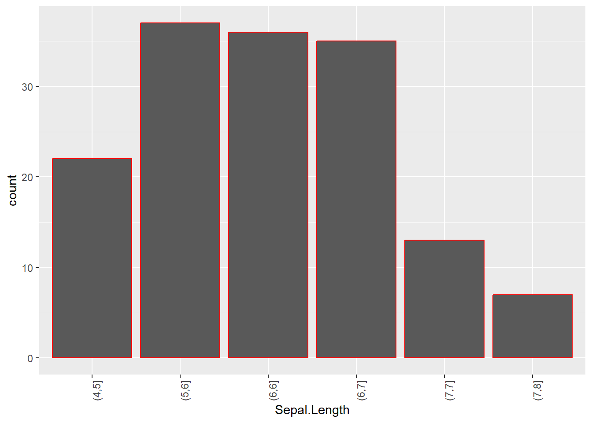
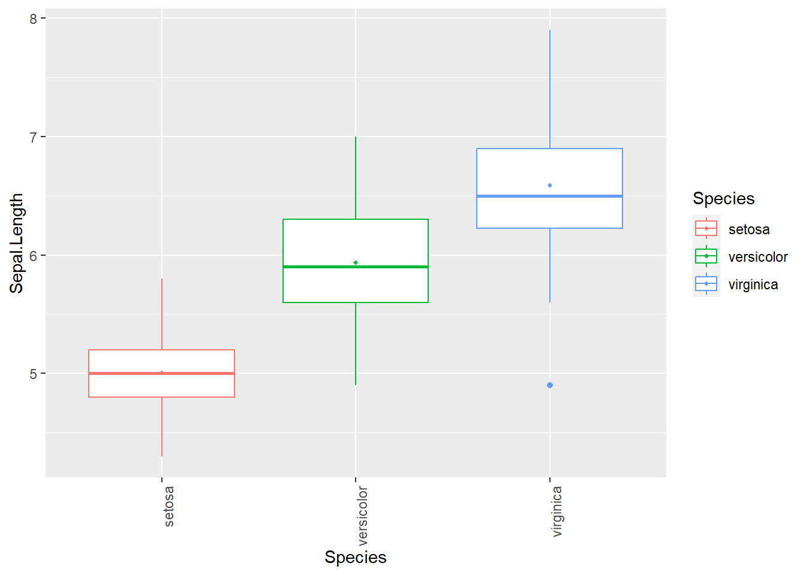
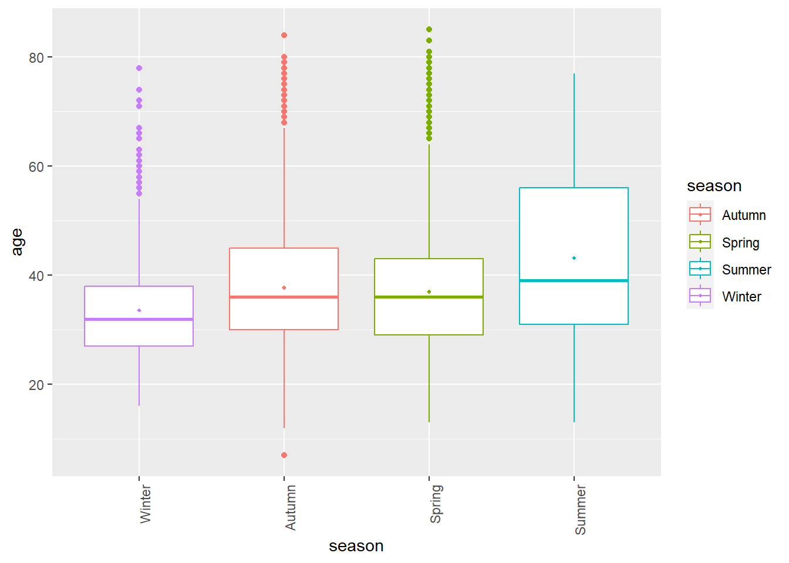

::: {.cell}

:::


# Contexte du projet 
Ce projet est réalisé dans le cadre de deux UE tout deux dirigés par Remi Drouilhet: l'UE "Logiciels spécialisés R" ainsi que l'UE "Outils de présentation et de recherche reproductible".  
Le projet en lui même concernant surtout le premier UE et le deuxième UE porté plus sur ce rapport mais également la présentation quarto qui est apporté en supplément.  
Ce projet a été réalisé par Robin Chaussemy et Yanis Micha.
Il a été dans un premier temps été réalisé en commun, puis chaqu'un à réalisé une partie bien distincte qui, mis à bout à bout permettent le rendu final de ce projet, mais qui, prise individuellement, peuve également se suffire à elle même.  
Ce projet est donc constitué de quatre principales parties:  

- La recherche du projet en lui même.
- L'analyse et le traitement des données choisies
- La réalisation d'une interface et des composantes/fonctionnalités qui lui incombe.
- la réalisation d'un apprentissage automatique sur le jeu de données.  


# Choix du projet
## Theme
Notre première envie était de travailler avec des données relatives à l'escalade.  
Après avoir eu l'idée de créer une carte interactive dans laquelle nous listerions tout les coins pour grimper avec leurs caractéristiques et la possibilité en se plaçant sur une carte de visualiser les endroits les plus proches pour escalader, nous avons préféré partir sur une autre idée: la prédiction sur un jeu de donnée relatif à l'escalade.  
Après quelques recherche, les jeux de données les plus pertinents et intéressants concernant l'escalade étant le recensement des expéditions himalayennes.  

## Choix du jeu de données
Il n'existe pas de nombreux jeux de données concernant les expéditions himalayennes, et les jeux de données existants se recoupent entre eux et leurs différences ne sont pas significatives.  
Nous avons d'abord choisi un jeu de données plus porté sur les morts lors des expéditions et leurs causes afin de pouvoir prédire cette dernière. En plus de ne pas être très joyeux, la proportion de mort parmi les expéditions himalayennes étant très faibles et avec des variables ne l'expliquant pas très bien, on s'est très vite rendu compte que cette apprentissage supervisé ne serait pas très pertinent. Nous nous sommes donc rabattus sur un autre jeu de données dont une variable nous intéressait plus pour de la prédiction: `success`,une variable indiquant le succès de l'expédition ou non du grimpeur.  
Notre jeu de données `expeditions` est un format csv contenant 76519 individus et 21 variables.  
Le jeu de données n'est pas du tout propre pour permettre une analyse poussée des données ainsi qu'un apprentissage supervisé. Une grande partie du travail à donc été de le nettoyer.[Traitement des données](#traitement-des-données)  

## Problématique
## Choix des langages
Pour nous permettre une initiation au language `Julia`, a été décidé de procéder à l'entièreté du traitement des données (préprocessing) ainsi qu'à leurs analyse.  
Pour ce qui est de l'interface, `Shiny`à été préféré pour sa facilité d'accès et de déploiement ainsi que sa facilité d'apprentissage pour des personnes initiés au language R contrairement à `dash` ou en encore `genie`.  Cependant, une comparaison d'utilisation de ses différentes possibilités d'interface avec leurs fonctionnalités, avantages et désavantages aurait été envisagé avec plus de temps (et sera bien entendu réalisé de notre côté).  
Enfin, pour ce qui est du Machine Learning et de l'apprentissage supervisé, nous avons choisi de comparer Python pour lequel le ML nous était déjà familier avec `Sci-kit-learn`, avec  Julia.  
Notre interface étant une application `shiny`, il nous a fallu pour ça utiliser des packages R permettant d'appeler ces languages au sein de notre application.  

# Analyse et traitement des données

::: {.cell hash='rapport_projet_cache/html/unnamed-chunk-2_a808a799808ba396b53f8f3cba041e5d'}

:::


## Traitement des données
### Gestion des données manquantes
Notre jeu de données comporte de nombreuse données manquantes principalement dans la variable `age`. L'âge d'un grimpeur étant une donnée qui nous est capitale pour prédire le succès, nous avons préféré évincer tout simplement toute ces données manquantes.  
A la suite de cette suppression de données, notre jeu de données 
comporte 73000 individus.  

### Agrégations des données
**peak_name**:  
Le nombre de modalités de cette variable était de 391! En plus d'avoir un nombre de sommets très important, l'hymalaya est une chaine de montagne connu pour avoir de multiples arrêtes démultipliant ce nombre de sommets. Les modalité de notre variable étant alors constitué de toute ces arêtes.  
*Exemple*: Annapurna étant un sommet constitué de 4 arêtes:  

- Annapurna
- Annapurna I Middle
- Annapurna II
- Annapurna III  

Nous avons donc agréger toute ces arêtes en un seul sommet permettant de diminuer drastiquement le nombre de modalités.  
Pour simplifier l'analyse, nous avons ensuite décider de ne garder que les 13 sommets avec le plus d'expéditions et de ranger tout les autres dans une nouvelle modalité: `autres`.  
Notre variable ne comportant donc plus que 14 modalités.  
<details>
<summary style="font-weight: bold; color: #72afd2;">Tableau de contingence</summary>

::: {.cell}

```{.r .cell-code}
table(data$peak_name)
```

::: {.cell-output .cell-output-stdout}
```

Ama Dablam  Annapurna     Autres   Baruntse        Cho Dhaulagiri    Everest 
      8235       3129      12454       2124       8790       2978      20994 
    Ganesh   Kangchen     Lhotse     Makalu    Manaslu     Pumori    Sharphu 
       553       2075       2615       2631       4610       1724         88 
```
:::
:::

</details>


**citizenship**:  
Cette variable recense les nationalités de chaque individu.  Certains avait une double nationalité nous avons gardé que leur première nationalité. Pour les autres nous n'avons garder sur 213  pays que les 28 pays les plus représentés et de disposer les nationalités les moins représentés dans une variable `autres`.  
<details>
<summary style="font-weight: bold; color: #72afd2;">Tableau de contingence</summary>

::: {.cell}

```{.r .cell-code}
table(data$citizenship)
```

::: {.cell-output .cell-output-stdout}
```

     Australia        Austria         Autres        Belgium         Canada 
          1430           2098           4955            460           1123 
         China Czech Republic Czechoslovakia         France        Germany 
          1933            649            355           4508           3415 
         India           Iran          Italy          Japan          Nepal 
          1770            327           2720           6199          14388 
   Netherlands    New Zealand         Norway         Poland         Russia 
           732            793            568           1382           1326 
       S Korea       Slovenia          Spain         Sweden    Switzerland 
          2885            564           3305            357           2420 
            UK        Ukraine            USA     Yugoslavia 
          5116            336           6396            490 
```
:::
:::

</details>
  
**expedition_role**
Cette variable à été fastidieuse à traiter. Elle répertorie le rôle du grimpeur lors de l'expédition. cela peut aller du simple grimpeur, au leader, les guides de montagnes ou même les équipes de film.  
En tout,c'est plus de 525 modalités.  Nous avons donc du faire le tri de ces différentes modalités et ne garder que celles qui ne nous paraissaient les plus pertinentes et comme pour `peak_name`et `citizenship` disposer les autres modalités dans une variable `autres`.  
En regardant le  nombre d'occurence de chaque modalités mais également la pertinence des modalités on décide de ne garder plus que 5 modalités:  

- `Leader` Le leader de la cordée.
- `Climber` Un grimpeur classique.
- `BaseCampStaff` Les médecins, les guides de montagnes, quelqu'un qui est payé pour accompagner la cordée.
- `Movie/TV_team` un membre d'une équipe de TV ou de Film.
- `Autres` tout les autres modalités.  

<details>
<summary style="font-weight: bold; color: #72afd2;">Tableau de contingence</summary>

::: {.cell}

```{.r .cell-code}
#code julia 
#map_to_String(s) = length(s) == 2 ? "Autres" :  (occursin("Leader",s) || occursin("leader",s)) ? #"Leader" : SubString(s,1:3) == "Cli" ? "Climber" : SubString(s,1:2) == "BC" ? "BaseCampStaff" : #(occursin("Tv",s) || occursin("Film",s)) ? "Movie/TV_team" : "Autres"
table(data$expedition_role)
```

::: {.cell-output .cell-output-stdout}
```

       Autres BaseCampStaff       Climber        Leader Movie/TV_team 
        16447           452         43928         12013           160 
```
:::
:::

</details>

### Création/suppression de variable
La variable age était en format String, nous l'avons donc naturellement transformé en un format int.  
Nous avons également supprimé de nombreuses variables qui ne nous paraissaient soit pas pertinente , soit n'ajoutant pas d'informations supplémentaires (redondances d'informations):  

- `death_cause` Cause de la mort. Variable intéréssante uniquement pour la prédiction de la mort de l'alpiniste. Evidémment cette variable n'étant renseigné que pour les individus ayant trouvés la mort, cette variable compte plus de 98% de valeurs manquantes.
- `death_height_metres` Hauteur de la mort. Idem que pour death_cause.
- `member_id` Numéro d'identification de l'individu. Il ne s'agit pas réellement d'une variable mais simplement d'une identification de l'individu qui ne nous intéresse pas.
- `expedition_id` Numéro d'identification de l'expédition. Cette variable nous permet seulement de savoir le nombre de personnes par cordée ce qui en soit pourrait être un élément important du succès. Il nous faudrait pour cela créer une nouvelle variable qui pour chaque individus indique le nombre de personnes dans sa cordée (en moyenne, 7 individus par cordée).  
- `highpoint_metres` Point le plus haut atteint par l'individu.  Variable intéressante mais quasiment 30 % de données manquantes ce qui la rend compliquée à traiter et à utiliser.
- `injury_height_metres`  Hauteur de la blessure de l'individu. Suppose une blessure ce qui n'es tpas forcément le cas, ce qui donne également une variable avec plus de 98% de données manquantes.
- `injury_type` Le type de la blessure. Même problème que pour la variable précédente.
- `peak_id` Numéro d'identification du sommet. N'ajoute pas plus d'informations que `peak_name`.  


### Présentation de notre DATA
Une fois nettoyé notre jeu de données comporte alors 73000 individus (les alpinistes) pour 13 variables:  

- `peak_name`: le nom du sommet qui est grimpé lors de l'expédition.
- `year`: l'année de l'expédition
- `season` : saison durant laquelle s'est déroulée l'expédition.
- `sex` : le genre de l'individu (Homme ou Femme).
- `age` : l'age de l'individu.
- `citizenship` : la nationalité de l'individu.
- `expedition_role` : le rôle dans la cordée de l'individu.
- `hired` :  variable indicatrice indiquant si l'individu est embauché pour réalisé son expédition ou non.
- `success` :  variable indicatrice indiquant si l'individu à réussi son expédition ou non.
- `oxygen_used` :  variable indicatrice indiquant si l'individu à utilisé de l'oxygène.
- `died` :  variable indicatrice indiquant si l'individu est décédé lor de l'expédition ou non.
- `injured` :  variable indicatrice indiquant si l'individu s'est bléssé ou non lors de l'expedition.  

**Le jeu de donnnées**:

::: {.cell hash='rapport_projet_cache/html/unnamed-chunk-6_bcece06ba1646f79dff163a601db1110'}
::: {.cell-output-display}
```{=html}
<div class="reactable html-widget html-fill-item-overflow-hidden html-fill-item" id="htmlwidget-69f430eebef9ada8fc3d" style="width:auto;height:auto;"></div>
<script type="application/json" data-for="htmlwidget-69f430eebef9ada8fc3d">{"x":{"tag":{"name":"Reactable","attribs":{"data":{"peak_name":["Ama Dablam","Autres","Everest","Ama Dablam","Everest","Baruntse","Everest","Everest","Everest","Baruntse","Everest","Everest","Cho","Manaslu","Everest","Ama Dablam","Manaslu","Everest","Autres","Ama Dablam","Autres","Makalu","Everest","Manaslu","Everest","Autres","Cho","Ama Dablam","Everest","Annapurna","Everest","Everest","Kangchen","Ama Dablam","Ama Dablam","Everest","Dhaulagiri","Everest","Annapurna","Cho","Manaslu","Everest","Everest","Manaslu","Autres","Autres","Annapurna","Everest","Everest","Makalu"],"year":[2014,1982,1999,1996,2017,2002,1988,2015,2015,2017,2003,2002,2017,1986,1979,2005,2016,2007,2001,2010,2008,2018,2003,2013,2010,1983,1998,2011,2001,1996,2004,1991,2000,2007,2000,2019,2013,2013,1969,1999,2018,2007,2019,1980,1991,2007,1950,1993,2001,2000],"season":["Autumn","Spring","Spring","Spring","Spring","Autumn","Spring","Spring","Spring","Autumn","Spring","Spring","Autumn","Autumn","Autumn","Autumn","Autumn","Spring","Autumn","Winter","Autumn","Spring","Spring","Autumn","Spring","Spring","Spring","Autumn","Spring","Spring","Spring","Spring","Spring","Autumn","Spring","Spring","Spring","Spring","Autumn","Autumn","Autumn","Spring","Spring","Autumn","Spring","Spring","Summer","Autumn","Spring","Winter"],"sex":["M","M","F","M","M","F","F","M","M","M","M","M","M","M","M","M","M","M","M","M","M","M","M","M","M","M","M","M","M","M","M","M","M","M","F","M","M","M","M","M","M","F","M","F","F","M","M","M","F","M"],"age":[46,27,33,36,33,52,25,32,31,64,29,24,30,31,31,65,35,32,37,25,37,35,23,50,36,31,43,60,27,29,32,29,57,38,34,33,37,41,43,38,40,20,31,29,34,51,51,28,32,45],"citizenship":["Nepal","Nepal","Canada","USA","China","Japan","USA","Nepal","India","UK","Belgium","Nepal","China","Autres","Nepal","Russia","Germany","Nepal","Belgium","Nepal","Nepal","France","France","Italy","USA","USA","Germany","France","USA","S Korea","Autres","USA","Austria","Nepal","Autres","Nepal","France","Nepal","Czechoslovakia","Slovenia","Spain","Nepal","Nepal","Czechoslovakia","Switzerland","Switzerland","UK","Nepal","USA","Poland"],"expedition_role":["Autres","Climber","BaseCampStaff","Climber","Autres","Climber","Autres","Autres","Autres","Climber","Climber","Autres","Autres","Autres","Autres","Climber","Climber","Autres","Climber","Climber","Autres","Climber","Climber","Climber","Leader","Climber","Climber","Climber","Climber","Climber","Leader","Climber","Leader","Autres","Climber","Autres","Climber","Autres","Climber","Leader","Climber","Climber","Autres","Climber","Climber","Leader","Autres","Autres","Autres","Climber"],"hired":["true","false","false","false","true","false","false","true","false","false","false","true","true","false","true","false","false","true","false","false","true","false","false","false","false","false","false","false","false","false","false","false","false","true","false","true","false","true","false","false","false","false","true","false","false","false","false","true","false","false"],"success":["false","true","false","false","true","false","false","false","false","false","false","true","true","false","true","false","false","true","true","true","true","false","false","false","false","false","true","true","false","false","true","false","false","true","false","true","false","true","false","false","true","false","true","false","false","true","false","true","false","false"],"solo":["false","false","false","false","false","false","false","false","false","false","false","false","false","false","false","false","false","false","false","false","false","false","false","false","false","false","false","false","false","false","false","false","false","false","false","false","false","false","false","false","false","false","false","false","false","false","false","false","false","false"],"oxygen_used":["false","false","false","false","true","false","false","false","false","false","false","true","true","false","true","false","false","true","false","false","false","false","false","false","false","false","false","false","false","false","true","true","false","false","false","true","false","true","false","false","true","true","true","false","false","false","false","true","false","false"],"died":["false","false","false","false","false","false","false","false","false","false","false","false","false","false","false","false","false","false","false","false","false","false","false","false","false","false","false","false","false","false","false","false","false","false","false","false","false","false","false","false","false","false","false","false","false","false","false","false","false","false"],"injured":["false","false","false","false","false","false","false","false","false","false","false","false","false","false","false","false","false","false","false","false","false","false","true","false","false","false","false","false","false","false","false","false","false","false","false","false","false","false","false","false","false","true","false","false","false","false","false","false","false","false"]},"columns":[{"id":"peak_name","name":"peak_name","type":"character","style":{"font-style":"italic"}},{"id":"year","name":"year","type":"numeric","style":{"font-style":"italic"}},{"id":"season","name":"season","type":"character","style":{"font-style":"italic"}},{"id":"sex","name":"sex","type":"character","style":{"font-style":"italic"}},{"id":"age","name":"age","type":"numeric","style":{"font-style":"italic"}},{"id":"citizenship","name":"citizenship","type":"character","style":{"font-style":"italic"}},{"id":"expedition_role","name":"expedition_role","type":"character","style":{"font-style":"italic"}},{"id":"hired","name":"hired","type":"character","style":{"font-style":"italic"}},{"id":"success","name":"success","type":"character","style":[{"color":"darkred"},{"color":"darkgreen"},{"color":"darkred"},{"color":"darkred"},{"color":"darkgreen"},{"color":"darkred"},{"color":"darkred"},{"color":"darkred"},{"color":"darkred"},{"color":"darkred"},{"color":"darkred"},{"color":"darkgreen"},{"color":"darkgreen"},{"color":"darkred"},{"color":"darkgreen"},{"color":"darkred"},{"color":"darkred"},{"color":"darkgreen"},{"color":"darkgreen"},{"color":"darkgreen"},{"color":"darkgreen"},{"color":"darkred"},{"color":"darkred"},{"color":"darkred"},{"color":"darkred"},{"color":"darkred"},{"color":"darkgreen"},{"color":"darkgreen"},{"color":"darkred"},{"color":"darkred"},{"color":"darkgreen"},{"color":"darkred"},{"color":"darkred"},{"color":"darkgreen"},{"color":"darkred"},{"color":"darkgreen"},{"color":"darkred"},{"color":"darkgreen"},{"color":"darkred"},{"color":"darkred"},{"color":"darkgreen"},{"color":"darkred"},{"color":"darkgreen"},{"color":"darkred"},{"color":"darkred"},{"color":"darkgreen"},{"color":"darkred"},{"color":"darkgreen"},{"color":"darkred"},{"color":"darkred"}],"filterable":false,"align":"center"},{"id":"solo","name":"solo","type":"character","style":{"font-style":"italic"}},{"id":"oxygen_used","name":"oxygen_used","type":"character","style":{"font-style":"italic"}},{"id":"died","name":"died","type":"character","style":{"font-style":"italic"}},{"id":"injured","name":"injured","type":"character","style":{"font-style":"italic"}}],"filterable":true,"searchable":true,"defaultPageSize":10,"showPageSizeOptions":true,"pageSizeOptions":[10,50,100],"highlight":true,"theme":{"color":"hsl(233, 9%, 87%)","backgroundColor":"hsl(233, 9%, 19%)","borderColor":"hsl(233, 9%, 22%)","stripedColor":"hsl(233, 12%, 22%)","highlightColor":"hsl(233, 12%, 24%)","inputStyle":{"backgroundColor":"hsl(233, 9%, 25%)"},"selectStyle":{"backgroundColor":"hsl(233, 9%, 25%)"},"pageButtonHoverStyle":{"backgroundColor":"hsl(233, 9%, 25%)"},"pageButtonActiveStyle":{"backgroundColor":"hsl(233, 9%, 28%)"}},"dataKey":"8d683035c2f747c6897f9350baa8115c"},"children":[]},"class":"reactR_markup"},"evals":[],"jsHooks":[]}</script>
```
:::
:::


## Analyse statistique des données
Après traitement des données, nous avons réalisé une analyse statistique des données plus poussée. Cette analyse s'est réalisée principalement à l'aide de visualisation graphiques sur Julia et de tests statistiques sur R.  

### Julia
L'analyse sur Julia à été faite surtout dans l'objectif de se familiariser avec les possibilités offertes par ce language notamment avec `StatsPlots` mais également avec `PlotlyJS`.  

### R
Bien que l'analyse graphique ait été faites avec Julia, l'exploration des packages `ggplot` et `plotly` ont permis de pousser celle ci sur R.  
En plus de cette dernière quelques tests statistiques ont été réalisés notamment dans l'objectif de tester la relation entre différentes variables.  
**Exemple**:   
Nous souhaitions savoir si l'âge  d'un individu dépendait selon le succès de l'expédition ou non. Pour espérer procéder à un test de student, nous regardons d'abord la distribution de nos deux groupes:

::: {.cell}
::: {.cell-output-display}
{width=672}
:::
:::

<details>
<summary style="font-weight: bold; color: #72afd2;">Voir le code</summary>

::: {.cell}

```{.r .cell-code}
plot_quanti("Density",data = data,variable_quanti1 = "age",modalites = "success",type = "ggplot")
```
:::

</details>

Les deux distributions on l'air de s'approcher d'une normale, on vérifie par un test de shapiro-wilk:  
$\mathcal{H}_0$: La distribution suit une loi normale.  
vs  
$\mathcal{H}_1$: La distribution ne suit pas  une loi normale.  


::: {.cell}
::: {.cell-output .cell-output-stdout}
```

	Shapiro-Wilk normality test

data:  sample(data[data$success == "false", "age"], 5000)
W = 0.9649, p-value < 2.2e-16
```
:::
:::

::: {.cell}
::: {.cell-output .cell-output-stdout}
```

	Shapiro-Wilk normality test

data:  sample(data[data$success == "true", "age"], 5000)
W = 0.97155, p-value < 2.2e-16
```
:::
:::

les deux tests  rejettent $\mathcal{H}_0$ à un seuil bien plus bas que 1%, on peut sans trop de risque affirmer que nos deux groupes suivent une loi normale et donc procéder à un test de student.  

Hypothèse:  
$\mathcal{H}_0$: $\mu_1=\mu2 \Leftrightarrow$ "La moyenne d'age des individus est le même qu'il réussisse ou non l'expédition.    
vs  
$\mathcal{H}_1$: $\mu_1>\mu2 \Leftrightarrow$ "La moyenne d'age des individus est différente selon qu'il réussisse ou non l'expédition.   

::: {.cell}
::: {.cell-output .cell-output-stdout}
```

	Two Sample t-test

data:  data$age by data$success
t = 25.969, df = 72998, p-value < 2.2e-16
alternative hypothesis: true difference in means between group false and group true is greater than 0
95 percent confidence interval:
 1.914861      Inf
sample estimates:
mean in group false  mean in group true 
           38.12058            36.07623 
```
:::
:::

On rejette $\mathcal{H}_0$ à un seuil bien en dessous de 1%, on peut donc affirmer qu'en moyenne, les individus qui réussissent leur expéditions sont moins agés que ceux qui ne réussisse pas.  


# Apprentissage automatique
## Python
## Julia
# Interface Shiny
## Objectif de l'interface
La création de l'interface avait pour première mission d'implémenter l'apprentissage automatique réalisé sur notre jeu de données. Ceci pour permettre à un utilisateur lambda de pouvoir jouer en prédisant le succès ou non de sa potentielle expédition Himalayenne suivant moultes conditions.  
L'idée principale était donc de pouvoir proposer à un non initié du Machine Learning une approche ludique de cette discipline en donnant une approximation somme toute relative de ses chances de réussite s'il venait à se lancer dans une expédition.  
Notre jeu de données n'étant pas réellement pertinent pour permettre une prédiction digne de ce nom, cela nous paraissait tout de même intéressant de mettre en place cette idée.  
Afin d'aller plus loin et de proposer également une expérience plus statistique, j'ai eu l'idée de dédié tout une partie de l'interface à l'analyse statistique et à la comparaison de graphiques.  
Les graphiques sont des outils formidables permettant de visualiser les données et les "faire parler".Avec le temps et les différentes versions de R, de nombreux packages permettant la visualisation ont fait leurs apparitions, avec des graphiques plus jolis (bien que subjectif), plus lisibles, avec plus de fonctionnalités et toujours plus d'options. Cependant, tout ces nouveaux packages ont leurs grammaires bien à eux et il demande d'y consacrer un minimum de temps. Il est également pas toujours chose aisé de choisir le graphique qui nous convienne le mieux suivant ce que l'on recherche: d'un graphique efficace qui va à l'essentielle à un graphique bourré d'options jusqu'à en perdre la vue.  
Mon idée est donc la suivante: et si, par le biais d'une interface, nous pourrions comparer plusieurs graphiques de différents packages avec seulement quelques cliques?
C'est donc ce que je me suis efforcer d'essayer de faire.  
Lorsque je parle des graphiques dans de nombreux packages, en plus de ceux implantés sur le package `base` sur R, on retrouve sur R surtout deux principaux packages (avec de nombreux packages subsidiaires et parfois complémentaires):  

- `ggplot2`
- `ploly` 

Bien que `plotly` est implanté à partir de `ggplot2`, je les distinguerais tout le long de ce projet, étant donné que de nombreuses options sont possibles sur `ggplot2` et pas sur `plotly` et vice-versa.  Bien que `plotly`intègre une fonction permettant d'envelopper un graphique `ggplot` et de le transformer en graphique interactif, cette fonction ne fonctionne que pour une partie des graphiques.  L'implentation de `ggplotly` dans mon interface permettra à l'utilisateur de se rendre compte des avantages et des limites de cette fonction.  

## Choix des graphiques
Pour tenter de comparer ces 3 packages (`base`,`ggplot2`,`plotly`), j'ai d'abord décidé de faire une liste de graphiques types qui me semble particulièrement utile et "indispensable" pour une bonne analyse. Cette liste, bien entendu non exhaustive a été confectionné selon trois catégories:  

- **Graphiques quantitatifs**: permettre de visualiser des données selon des variables quantitatives.
- **Graphiques qualitifs**: permettre de visualiser des données selon des variables qualitatives.
- **Graphique quantitatif/qualitatifs**: permettre de visualiser des données quantitatives/qualitatives, en fonction de données qualitatives.  

J'ai ensuite crée un fichier `comparaison_graphiques.r` dans lequel je choisis plusieurs graphiques par catégories qui me semblent les plus pertinents pour une analyse de donnée standart. Dans ce fichier je regroupe par graphique les possibilités de chaque package.  
Voici la liste des graphiques retenus:  

### Graphique quantitatif
#### Histogramme
**Objectif**: Visualiser la distribution des valeurs d'une variable quantitative en regroupant les données en intervalles (bins).  
**Avantages** : Donne une idée de la forme de la distribution, des tendances centrales et de la dispersion.  
Permet également à l'utilisateur de pouvoir choisir le nombre de bins.  
**Inconvénients** : Sensible au choix des bins, peut être difficile à interpréter si le nombre de bins est mal choisi.  

L'intérêt de l'histogramme sera donc de pouvoir explorer la forme globale de la distribution.  

#### Courbe de densité
**Objectif** : Estimer la densité de probabilité de la distribution des données continues.  
**Avantages** : Lisse la distribution, facilite la visualisation des modes et des tendances.  
**Inconvénients** : Dépend du choix de la méthode d'estimation de la densité (il me semble que d'un package à l'autre il s'agit des mêmes estimations donc pas de réel différence entre eux sur ce point).  
L'intérêt de la courbe de densité sera donc d'obtenir une représentation plus lisse de la distribution que celle de l'histogramme.  

#### Scatterplot
**Objectif** : Examiner la relation entre deux variables quantitatives.  
**Avantages** : Permet de visualiser la dispersion des points et les relations entre les variables.  
**Inconvénients** : Peut être difficile à interpréter avec un grand nombre de points, ne montre pas toujours la densité des points (d'où l'intérêt de méthodes un peu différentes et plus pertinentes utilisés pour `ggplot2`et `plotly`.
L'intérêt du scatterplot sera donc surtout de pouvoir explorer la relation entre deux variables quantitatives.  
La possibilité de visualiser ces données en les discriminant par rapport à une variable indicatrice est également prise en compte car très utile dans l'analyse de données.  

#### boxplot
**Objectif** : Résumer la distribution des valeurs en mettant en évidence les mesures de position (médiane, quartiles) et les valeurs aberrantes.  
**Avantages** : Donne une vue rapide des mesures de dispersion, identifie les valeurs aberrantes.  
**Inconvénients** : Ne montre pas la forme détaillée de la distribution, peut ne pas être aussi informatif avec des distributions asymétriques .  
L'intérêt du boxplot sera donc de résumer la distribution et identifier les valeurs aberrantes. Dans le cas d'une distribution asymétrique, nous pouvons tout à fait procéder à un regroupement des données par intervalles (et donc avoir un résumé de la distribution et des valeurs aberrantes par intervalles).  

### Graphiques qualitatifs
#### barplot
**Objectif** : Visualiser la distribution des catégories d'une variable qualitative en utilisant des barres.  
**Avantages** : Facile à interpréter, montre la fréquence ou la proportion de chaque catégorie.  
**Inconvénients** : Peut être moins informatif pour de nombreuses catégories.C'est là que la selection de modalités entre en jeu: une séléction des modalités directement intégré dans le graphique comme c'est le cas pour `plotly` est un vrai plus dans ce cas. Un tri (croissant ou décroissant) des barres peut également permettre une meilleure visibilité du graphique.   
L'intérêt du barplot sera donc de montrer la fréquence ou la proportion de chaque catégorie d'une variable catégorielle.  

#### mosaicplot
**Objectif** : Représenter graphiquement les relations entre deux variables catégorielles en utilisant des zones rectangulaires proportionnelles aux fréquences.  
**Avantages** : Montre les relations jointes entre deux variables catégorielles.  
**Inconvénients** : Peut être complexe avec de nombreuses catégories et parfois illisible.  

### Graphiques quantitatifs/qualitatifs
#### Courbe de densité
**Objectif**: regarder ici la densité d'une partie de notre jeu de données.    
**Exemple**: Nous souhaitons voir si la densité de l'âge d'une personne en fonction du sexe suit une loi normale, nous allons donc représenter deux densités de la variable `age`: une pour les hommes et une pour les femmes.  

#### barplot
**Objectif**: analyser une variable qualitative ou quantitative, en fonction d'une autre variable qualitative.  
L'intérêt sera donc de pouvoir visualiser sur une valeur précise de la première variable, quels sont les modalités les plus présentes de la deuxième variable.    
**Exemple**: je regarde la catégorie professionnelle d'une personne.  Je voudrais savoir quelle est la proportion d'hommes et de femmes pour chaque catégories.  

#### boxplot
**Objectif**: représenter un résumé de la distribution et des valeurs aberrantes en fonction des modalités d'une variable catégorielle.  
**Exemple**: Je souhaite savoir si la distribution de la taille d'une personne est semblable entre un homme et une femme.  

#### Scatterplot
**Objectif**: visualiser une relation entre deux variables quantitatives sur une partie de la population.  
**Exemple**: Je souhaite regarder la relation entre la taille et le poids chez les Americains et comparer cette relation taille/poids avec celle chez les Français.  


## Résumés statistiques
En plus de cette comparaison des graphique, j'ai souhaité ajouter une simple visualisation des résumés statistiques pour permettre à l'utilisateur moyen d'avoir un premier aperçu de ses données.  

### Variable quantitative
En plus d'un simple résumé statistique de la variable, je propose à l'utilisateur de pouvoir discriminer cette dernière en fonction des modalités d'une variable catégorielle.  
**Exemple**: Je souhaite voir les différents estimateurs statistiques (moyennes, médianes,...) de l'âge des personnes travaillant dans le domaine de la santé.  

### Variable qualitative
En plus des effectifs et de la fréquence de chaque modalité de la variable,j'ajoute les frequences cumulées (utile surtout pour les variables catégorielles ordinales).  


## Workflow de l'interface
La disposition des éléments, les différentes fonctionnalités,etc... 
Comme toute personne qui apprend une nouvelle notion informatique (ici la réalisation d'une interface shiny), j'ai procédé par essai-erreur. L'avantage de ce procédé est qu'il m'a permis d'en apprendre énormément sur la réalisation d'une interface shiny. Cela m'a permis de découvrir pleins de packages utiles, que ce soit des packages inhérent à la modélisation de l'interface, à son design et bien entendu à l'analyse de données.  
En revanche, ce procédé fait qu'aujourd'hui mon interface est largement perfectible, surtout en ce qui concerne le placement des objets shiny et les possibles interactions entre eux. Pour permettre une meilleure modélisation de mes interfaces dans le futur, je procèderais en amont à un worflow de mon interface (ce que je fais déja avec un autre projet).  

### Structure de l'interface shiny
L'interface se décompose en 3 principales parties:  

- DATA
- Analyse
- Prédictions  

#### DATA
Dans cette partie, nous y retrouvons deux onglets, l'onglet permettant de visualiser le jeu de donnés en format assez classique, et un autre onglet inhérent aux résumés statistiques.  Pour ce dernier onglet, il reste pour le moment très minimaliste et fera l'objet d'améliorations (voir les axes d'améliorations en dernière partie).  
Pour ce qui est du jeu de données, j'ai fait le choix d'utiliser le package `reactable` pour permettre de nombreuses personnalisations sur ce dernier.  
`reactable` est un package permettant la création de tableaux interactifs. Les options qui ont étés retenus sont les suivantes:  

- la recherche d'informations par variables: `searchable=TRUE`.  
Pour chaque colonne dont l'option est activé, une case de recherche est mise à disposition.  
**Exemple**: Je souhaite seulement regarder les expeditions himalayennes faites par les français, je cherche `france`dans la colonne `citizenship`.  
- le tri du jeu de données: `filterable=TRUE`.  
Permet de trier par ordre croissant ou décroissant le jeu de donnnée par rapport à la colonne spécifiée.  
**Exemple**: je cherche à trié les expéditions himalayennes par âges croissant des grimpeurs pour regarder les expeditions des plus jeunes.
- le design des cases: changer la couleur, la forme, le style d'une colonne en fonction de ses modalités.  
**Exemple**: Pour permettre une meilleure visualisation de notre variable cible `success`, changer la couleur en fonction de la réussite ou non (<span style="color:green;">vert</span> pour TRUE, <span style="color:red;">**rouge**</span> pour FALSE).  
D'autres options ont étés utilisés surtout dans un objectif d'esthétique mais cela ralentissait grandement le chargement du jeu de données lors du lancement de l'interface ce qui n'est pas très agréable. Pour contrer ça il faudrait faire cette mise en forme seulement pour les données affichées et non pour le dataset entier.  

#### Analyse
Trois onglets sont disponible à l'intérieur de celui-ci.  
Ces trois onglets corresponds à la distinction des graphiques en trois catégories faites auparavant: graphiques quantitatives, graphiques qualitatifs et graphiques quantiatifs/qualitatifs.  
Dans le menu de l'onglet `Analyse` se trouve des boutons radios `prettyRadioButtons` permettant de choisir le package utilisé pour faire le graphique: classique (pour `base`), ggplot et plotly.  
Chaque onglet est disposé de la même manière: une partie `sidebarpanel`dans lequel l'utilisateur choisis le graphique qu'il souhaite tracer, les variables qu'il souhaite visualiser et quelques options supplémentaires (des `slider` pour changer les intervalles de certains graphiques,des variables à discriminer, etc.). Afin d'éviter un rafraichissement du graphique à chaque modification, et pour permettre à l'utilisateur de prendre son temps pour choisir toute ses options de graphiques, un boutton d'execution est mis à disposition. Pour tracer le graphique, il suffit d'appuyer sur ce boutton. Il suffit de switch entre les différents packages de graphique pour pouvoir les comparer. L'autre partie de l'onglet `mainpanel`étant dédié à l'affichage du graphique.  

#### Prédictions
Cet unique onglet contient le travail d'apprentissage supervisé réalisé sur notre jeu de données. Comme indiqué ci-dessus,notre objectif était de permettre à un utilisateur lambda de pouvoir prédire le succès de sa potentielle expédition himalayenne.  
Pour cela,l'onglet est constitué d'un `sidebarpanel` dans lequel
est posé plusieurs questions à l'utilisateur: son âge,sa nationalité, s'il souhaite grimper tout seul ou accompagné,ect.  
Ces questions sont en fait relatifs aux différentes variables qui nous ont permis de procéder à l'apprentissage de notre jeu de données, afin de prédire le taux de succès d'une expédition en particulière.  
Dans le `mainpanel` se constitue deux parties, une donnant les résultats provenant de l'apprentissage réalisé sur python et une autre sur Julia. Cela pour permettre de comparer l'apprentissage des modèles choisis sur les deux langages.  
Enfin, il est également possible dans le menu de changer de modèle d'apprentissage en passant du modèle KNN à celui de randomforest.  

#### Guide
Afin de permettre à un n'importe qui de comprendre le fonctionnement de chaque onglet, un guide interactif a été ajouté à l'aide du package `cicerone`.  
Ce package permet à l'aide d'un script r de préciser les emplacements de chaque input de l'interface, afin de guider au mieux l'utilisateur.  
**Exemple**:  
  
  


## Création de packages
Pour permettre de rendre plus aisé la compréhension du code de mon application shiny, j'ai crée deux packages:  

- *scindeR*
- *compaR*  

### scindeR
Ce package très simpliste permet de scinder une data selon les types de variables.  
La fonction scinde(data) permet de récupérer les noms de variables selon le type de variable.  
**Exemple**:  

::: {.cell}

```{.r .cell-code}
data("Orange")
scindeR::scinde(Orange)
```

::: {.cell-output .cell-output-stdout}
```
$quanti
[1] "age"           "circumference"

$quali
[1] "Tree"

$binaire
NULL
```
:::
:::

On peut également préciser le type de variable que l'on souhaite récupérer, pour récupérer un subdata seulement de ce type.  
**Exemple**

::: {.cell}

```{.r .cell-code}
kable(head(scindeR::scinde(Orange,"quanti")))
```

::: {.cell-output-display}
`````{=html}
<table>
 <thead>
  <tr>
   <th style="text-align:right;"> age </th>
   <th style="text-align:right;"> circumference </th>
  </tr>
 </thead>
<tbody>
  <tr>
   <td style="text-align:right;"> 118 </td>
   <td style="text-align:right;"> 30 </td>
  </tr>
  <tr>
   <td style="text-align:right;"> 484 </td>
   <td style="text-align:right;"> 58 </td>
  </tr>
  <tr>
   <td style="text-align:right;"> 664 </td>
   <td style="text-align:right;"> 87 </td>
  </tr>
  <tr>
   <td style="text-align:right;"> 1004 </td>
   <td style="text-align:right;"> 115 </td>
  </tr>
  <tr>
   <td style="text-align:right;"> 1231 </td>
   <td style="text-align:right;"> 120 </td>
  </tr>
  <tr>
   <td style="text-align:right;"> 1372 </td>
   <td style="text-align:right;"> 142 </td>
  </tr>
</tbody>
</table>

`````
:::
:::


### compaR
Ce package réunit l'ensemble des graphiques utilisés pour l'interface shiny.  
Il est composé d'une part d'une fonction par type de graphique: boxplot,histogramme,...
D'autre part d'une fonction par catégorie de graphique: quantitatif,qualitatif,quantitatif/qualitatif.  
Dans chaque fonction est en fait implémenté un graphique pour chaque package que l'on souhaite comparer.  
**Exemple** avec l'histogramme: 
<details>
<summary style="font-weight: bold; color: #72afd2;">Voir le code</summary>

::: {.cell}

```{.r .cell-code}
histogramme(iris,"Sepal.Length",nbClasses = 6,color="red",type="classique")
histogramme(iris,"Sepal.Length",nbClasses = 6,color="red",type="ggplot")
histogramme(iris,"Sepal.Length",nbClasses = 6,color="red",type="plotly")
```
:::

</details>

::: {.cell}
::: {.cell-output-display}
{width=672}
:::

::: {.cell-output-display}
{width=672}
:::

::: {.cell-output-display}
```{=html}
<div class="plotly html-widget html-fill-item-overflow-hidden html-fill-item" id="htmlwidget-166ae35185297e61cd5c" style="width:100%;height:464px;"></div>
<script type="application/json" data-for="htmlwidget-166ae35185297e61cd5c">{"x":{"visdat":{"50da5dba1d7f":["function () ","plotlyVisDat"]},"cur_data":"50da5dba1d7f","attrs":{"50da5dba1d7f":{"x":{},"xbins":{"size":0.60000000000000009},"marker":{"color":"red"},"alpha_stroke":1,"sizes":[10,100],"spans":[1,20],"type":"histogram"}},"layout":{"margin":{"b":40,"l":60,"t":25,"r":10},"xaxis":{"domain":[0,1],"automargin":true,"title":"Sepal.Length"},"yaxis":{"domain":[0,1],"automargin":true},"hovermode":"closest","showlegend":false},"source":"A","config":{"modeBarButtonsToAdd":["hoverclosest","hovercompare"],"showSendToCloud":false},"data":[{"x":[5.0999999999999996,4.9000000000000004,4.7000000000000002,4.5999999999999996,5,5.4000000000000004,4.5999999999999996,5,4.4000000000000004,4.9000000000000004,5.4000000000000004,4.7999999999999998,4.7999999999999998,4.2999999999999998,5.7999999999999998,5.7000000000000002,5.4000000000000004,5.0999999999999996,5.7000000000000002,5.0999999999999996,5.4000000000000004,5.0999999999999996,4.5999999999999996,5.0999999999999996,4.7999999999999998,5,5,5.2000000000000002,5.2000000000000002,4.7000000000000002,4.7999999999999998,5.4000000000000004,5.2000000000000002,5.5,4.9000000000000004,5,5.5,4.9000000000000004,4.4000000000000004,5.0999999999999996,5,4.5,4.4000000000000004,5,5.0999999999999996,4.7999999999999998,5.0999999999999996,4.5999999999999996,5.2999999999999998,5,7,6.4000000000000004,6.9000000000000004,5.5,6.5,5.7000000000000002,6.2999999999999998,4.9000000000000004,6.5999999999999996,5.2000000000000002,5,5.9000000000000004,6,6.0999999999999996,5.5999999999999996,6.7000000000000002,5.5999999999999996,5.7999999999999998,6.2000000000000002,5.5999999999999996,5.9000000000000004,6.0999999999999996,6.2999999999999998,6.0999999999999996,6.4000000000000004,6.5999999999999996,6.7999999999999998,6.7000000000000002,6,5.7000000000000002,5.5,5.5,5.7999999999999998,6,5.4000000000000004,6,6.7000000000000002,6.2999999999999998,5.5999999999999996,5.5,5.5,6.0999999999999996,5.7999999999999998,5,5.5999999999999996,5.7000000000000002,5.7000000000000002,6.2000000000000002,5.0999999999999996,5.7000000000000002,6.2999999999999998,5.7999999999999998,7.0999999999999996,6.2999999999999998,6.5,7.5999999999999996,4.9000000000000004,7.2999999999999998,6.7000000000000002,7.2000000000000002,6.5,6.4000000000000004,6.7999999999999998,5.7000000000000002,5.7999999999999998,6.4000000000000004,6.5,7.7000000000000002,7.7000000000000002,6,6.9000000000000004,5.5999999999999996,7.7000000000000002,6.2999999999999998,6.7000000000000002,7.2000000000000002,6.2000000000000002,6.0999999999999996,6.4000000000000004,7.2000000000000002,7.4000000000000004,7.9000000000000004,6.4000000000000004,6.2999999999999998,6.0999999999999996,7.7000000000000002,6.2999999999999998,6.4000000000000004,6,6.9000000000000004,6.7000000000000002,6.9000000000000004,5.7999999999999998,6.7999999999999998,6.7000000000000002,6.7000000000000002,6.2999999999999998,6.5,6.2000000000000002,5.9000000000000004],"xbins":{"size":0.60000000000000009},"marker":{"color":"red","line":{"color":"rgba(31,119,180,1)"}},"type":"histogram","error_y":{"color":"rgba(31,119,180,1)"},"error_x":{"color":"rgba(31,119,180,1)"},"xaxis":"x","yaxis":"y","frame":null}],"highlight":{"on":"plotly_click","persistent":false,"dynamic":false,"selectize":false,"opacityDim":0.20000000000000001,"selected":{"opacity":1},"debounce":0},"shinyEvents":["plotly_hover","plotly_click","plotly_selected","plotly_relayout","plotly_brushed","plotly_brushing","plotly_clickannotation","plotly_doubleclick","plotly_deselect","plotly_afterplot","plotly_sunburstclick"],"base_url":"https://plot.ly"},"evals":[],"jsHooks":[]}</script>
```
:::
:::

Chacun de ces graphiques se retrouve implémenter dans une des trois fonctions représentant les catégories.  
**Exemple** avec le boxplot:
<details>
<summary style="font-weight: bold; color: #72afd2;">Voir le code</summary>

::: {.cell}

```{.r .cell-code}
plot_quanti_quali(plot_type = "boxplot",data = iris,var_quanti1 = "Sepal.Length",var_quali = "Species",type = "ggplot")
```
:::

</details>

::: {.cell}
::: {.cell-output-display}
{width=672}
:::
:::


# Conclusion

## Reflexion sur l'expérience du projet
## les compétences acquises 
### Julia
- Apprentissage du langage
- Initiation au multiple dispatching
- Apprentissage supervisé  


### R
- apprentissage de Shiny  et des différentes options
- découverte de dash: non présenter mais apprentissage des bases.
- Prise en main poussé des packages ggplot2 et plotly
- Initiation aux packages permettant d'utliser d'autres langages tels que Julia et python au sein de R.

## axes d'amélioration du projet
### Analyse et traitement de données
- gestion des NA dans notre jeu de données  
Nous avons décidé d'enlever les lignes comportant des données manquantes, nous aurions pu choisir une autre approche.  
Une possibilité était de remplacer ces données manquantes par les données les plus probables, avec par exemple l'approche des K plus proches voisins. Cette méthode consiste à prendre la ligne concerné par la donnée manquante et de la comparer avec les autres lignes. On choisis les k lignes les plus "proches" de celle ci et on donne comme valeur à la donnée manquante la moyenne des valeurs de ces k lignes.  
Cependant, avec les données présentes dans les autres variables, aucune n'était pertinente pour supposer l'âge manquant de l'individu.  


### Interface

- Pouvoir récupérer le code du graphique qui  plait à l'utilisateur.    
Ajouter pour cela un boutton permettant de visualiser le code effectué par le package `compaR`pour afficher le graphique ainsi que le code correspondant dans le package choisis (`base`,`ggplot`, `plotly`).  
**Exemple**:

::: {.cell}
::: {.cell-output-display}
{width=672}
:::
:::

<details>
<summary style="font-weight: bold; color: #72afd2;">Voir le code</summary>

::: {.cell}

```{.r .cell-code}
#code compaR
plot_quanti_quali(plot_type = "boxplot",data=data,"age",var_quali = "season",type = "ggplot")
#code ggplot
ggplot(data,aes(y = age, x = season,color = season))+
  geom_boxplot()+
  stat_summary(fun = "mean", geom = "point", shape = 19, size = 1)
```
:::

</details>
- Pouvoir discriminer une variable quanti par une autre dans les résumés avec des bins et un slider.  
**Exemple**: je veux connaître les différents estimateurs de la distribution (moyenne,mediane,...) de tout les personnes agées de 40 a 60 ans entre 1960 et 2000.  
- Ajouter la possibilité de rajouter/supprimer une ligne dans la data directement depuis l'interface. 
- Ajouter graphique interactif avec animation  
`plotly` permet égalément de visualiser des graphiques avec animations ce qui est particulièrement utile pour les données temporelles mais également pour observer des graphiques par sous-population.  
**Exemple**:

::: {.cell}

```{.r .cell-code}
p <- ggplot(data, aes(x = year, y = age)) + geom_point()
ggplotly(p + aes(frame = citizenship)) |> animation_opts(frame = 1500, transition = 500)
```
:::


### packages

- Utilisation plus poussé de R, notamment du S3 pour améliorer le package `compaR`.
- Creation de packages julia pour une amélioration du traitement de données.  


### Machine Learning
Ajouter une comparaison avec l'aprentissage supervisé implémenté dans R avec le package `tidyverse`.  
Ajouter des modèles d'apprentissages.  
Permettre d'automatiser le machine learning dans l'inerface pour n'importe quel jeu de données en laissant à l'utilisateur le choix du jeu de données ainsi que la *target* à prédire.  

  
  
## Conclusion générale
Ce projet aura été d'une utilité formidable pour progresser, autant dans l'apprentissage de certains packages:

- `ggplot2`,`plotly` et de leurs grammaire pour ce qui est de la visualisation statistique.
- `shiny` pour ce qui est de la création d'interface.
- `quarto`pour la création de rapport statistiques et de la présentation.
- les packages permettant d'appeler du code Julia et Python au sein du language R.  

Mais également dans l'apprentissage d'un nouveau language `Julia` et de ses fonctionnalités.  
Il a permis également de progresser en Machine Learning...  


